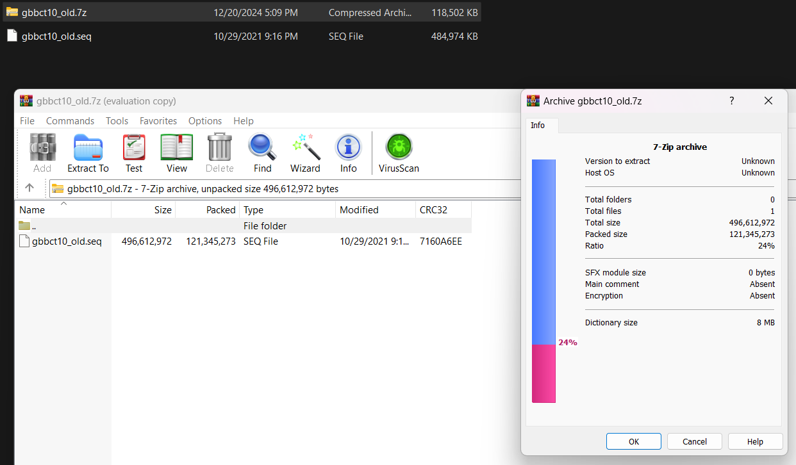

# Huffman Compression Analysis

**For `gbbct10_old.seq` :**

| **Value Of N** | **Compression Ratio** |
| --- | --- |
| 1 | 50.665% |
| 2 | 41.984% |
| 3 | 37.632% |
| 4 | 35.571% |
| 5 | 40.003% |
- **7Zip Compression Ratio:** 24%

**For `Algorithms - Lectures 7 and 8 (Greedy algorithms).pdf` :**

| **Value Of N** | **Compression Ratio** |
| --- | --- |
| 1 | 93.51% |
| 2 | 147.42% |
| 3 | 270.36% |
| 4 | 231.73% |
| 5 | 193.32% |
- **7Zip Compression Ratio:** 68%
    
    
    
    
    

> Formula used for Compression Ratio = $\frac{Size\:After\:Compression}{Size\:Before\:Compression}$
> 

## Observations And Explanations

- In case of `.seq` files, These files are editable text files that contain a DNA sequence,  so there are large patterns and repetitions so Huffman Coding works well with that case, but still 7-Zip is slightly better in that case.
- Here’s a snippet from inside the file, as you see there are large amount of repeated pattern which helps Huffman Coding algorithm.

- In case of `.pdf`  files, These files are complex files with embedded metadata, image and text.. So Huffman Coding struggles to find patterns and doesn’t work well with that case.

---

## Screenshots Running The Tests

**For `gbbct10_old.seq` :**

**At N=1:**

Compression:

Decompression:

**At N=2:**

Compression:

Decompression:

**At N=3:**

Compression:

Decompression:

**At N=4:**

Compression:

Decompression:

**At N=5:**

Compression:

Decompression:

---

**For `Algorithms - Lectures 7 and 8 (Greedy algorithms).pdf` :**

**At N=1:**

Compression:

Decompression:

**At N=2:**

Compression:

Decompression:

**At N=3:**

Compression:

Decompression:

**At N=4:**

Compression:

Decompression:

**At N=5:**

Compression:

Decompression:

